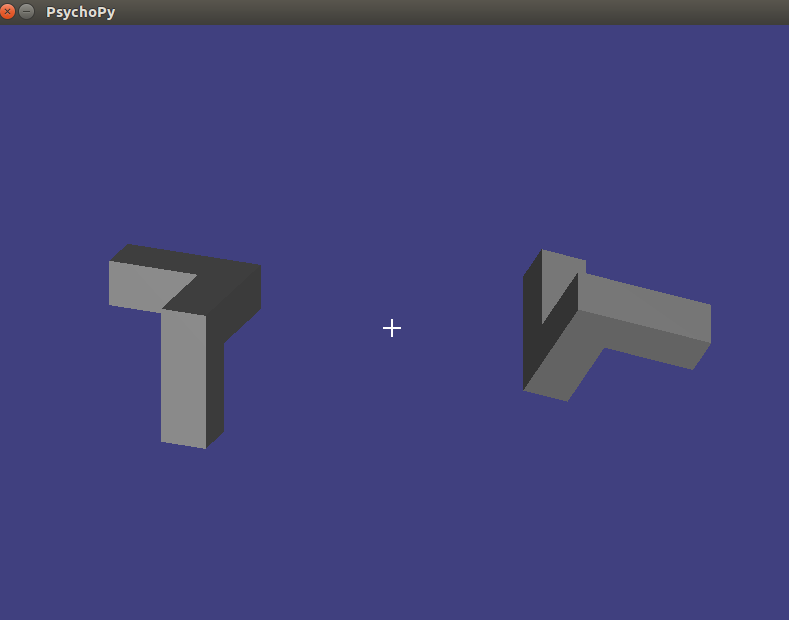

# 3D Mental Rotation Experiment Script

Demonstration of using Psychopy and ratCAVE to run a 3D Mental rotation cognitive psychology experiment.



## Instructions

To run the experiment, simply clone this repository, install the required python packages listed in 'requirements.txt',
and run the run.py file with Python 2 (because Psychopy is Python2-only):

```bash
git clone https://github.com/nickdelgrosso/mental_rotation_exp
cd mental_rotation_exp
pip install -r requirements.txt
python run.py
```


Options for the experiment can be changed by modifying values in the
'config.py' file.


Example data that results from the experiment can be found in 'data', and
some example analysis of the data can be found in 'jupyter_notebooks'.  A
video showing the experiment in action is available in 'video'.